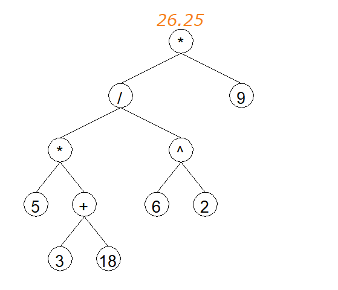

# CalculaTreece

    
    
    
    

A calculator, linked to trees

## How to use

- Download python 3.10 from [here](https://www.python.org/downloads/)
- Download this repository using `git clone` or the download button
- Open a terminal in the folder where you downloaded the repository
- Run `python -m pip install -r requirements.txt` to install the dependencies
- Run `python main.py` to start the program

## Calculator features

- Calculate the value of an expression, you can for example calculate the value of `5(8-2)` without any problem
- Solve basic equations, for example `4x-2=10` will be solved to `2`
- Derive expressions, for example `sqrt(x)` will be derived to `-1/x^2`
- And the coolest feature, you can draw your expressions, here is the result of `5(3+18)/6^2*9`:

All this calculator works with trees, expressions are converted to trees and then calculated, derived or drawn.
For now, you can only use infix expressions, but we plan to add support for prefix and postfix expressions.