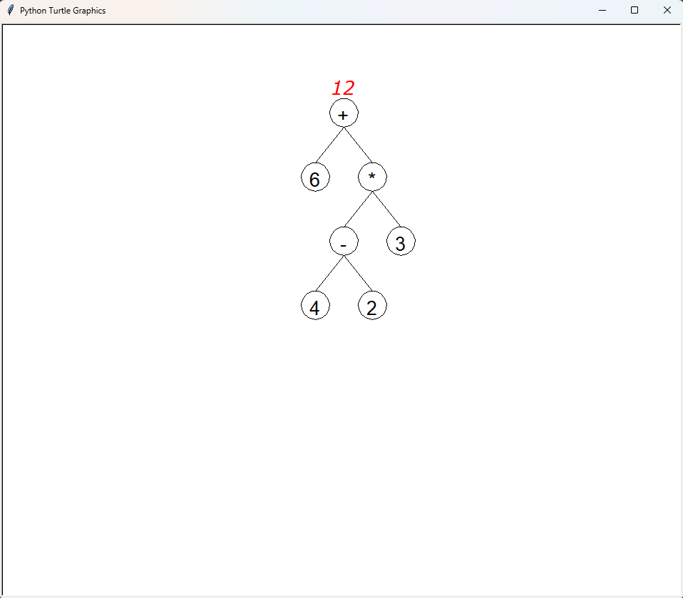

# CalculaTreece

    
    
    
    

A calculator, linked to trees

## How to use

- Download python 3.10 from [here](https://www.python.org/downloads/)
- Download this repository using `git clone` or the download button
- Open a terminal in the folder where you downloaded the repository
- Run `python -m pip install -r requirements.txt` to install the dependencies
- Run `python main.py` to start the program

## Calculator features

- Calculate the value of an expression, you can for example calculate the value of `5(8-2)` without any problem
- Solve basic equations, for example `4x-2=10` will be solved to `3`
    - Only developed equations are supported, for example `x(x+1)=4` will give the wrong result, may be fixed later
- Derive expressions, for example `sqrt(x)` will be derived to `1/2sqrt(x)`
- And the coolest feature, you can draw your expressions, here is the result of `6+(4-2)*3`:

All this calculator works with trees, expressions are converted to trees and then calculated, derived or drawn.
For now, you can only use infix expressions, but we plan to add support for prefix and postfix expressions.

## Interface

Here is the application interface:

You can resize the windows to your liking, the interface will adapt to the size of the window.

#### Buttons

Ambiguous buttons are listed here, the other are just easy to understand

- `C` : Clear the input (and the old result)
- `DEL` : Delete the last character of the input
- `d/dx` : Derive the input
- `x^n` : Add `^` to the input (for example `2^3` will be `8`)
- `x` : Add `x` to the input
- `Draw` : Draw the input into a tree
- `Hist.` : Switch to the history tab
- `=` : Add `=` to the input
- `EXE` : Calculate the input (or solve the equation, depending on the presence of `=` in the expression)
