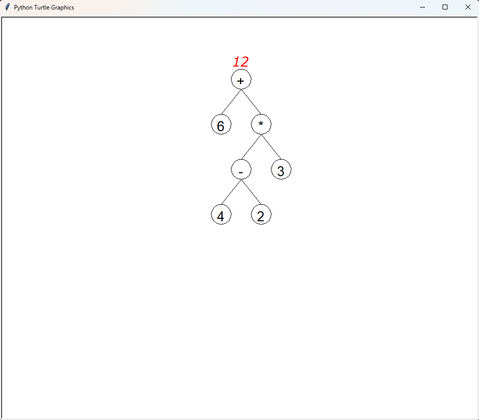
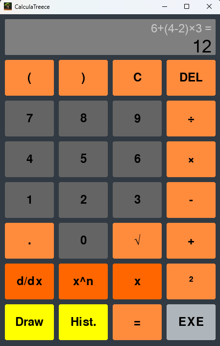

# CalculaTreece

    
    
    
    

Une calculatrice liée aux arbres

## Comment utiliser

- Téléchargez Python 3.10 à partir de [ce lien](https://www.python.org/downloads/)
- Téléchargez ce dépôt en utilisant git clone ou le bouton de téléchargement
- Ouvrez un terminal dans le dossier où vous avez téléchargé le dépôt
- Exécutez la commande `python -m pip install -r requirements.txt` pour installer les dépendances
- Exécutez la commande `python main.py` pour lancer le programme

## Fonctionnalités de la calculatrice

- Calculer la valeur d'une expression, vous pouvez par exemple calculer la valeur de `5(8-2)` sans aucun problème
- Résoudre des équations simples, par exemple `4x-2=10` sera résolu en `3`
  - Seules les équations simples sont prises en charge, par exemple `x(x+1)=4` donnera un résultat incorrect et pourra être corrigé ultérieurement
- Dériver des expressions, par exemple `sqrt(x)` sera dérivé en `1/2sqrt(x)`
- Et la fonctionnalité la plus cool, vous pouvez dessiner vos expressions, voici le résultat de `6+(4-2)*3` :

Toute cette calculatrice fonctionne avec des arbres, les expressions sont converties en arbres, puis calculées, dérivées ou dessinées.
Pour le moment, vous ne pouvez utiliser que des expressions infixes, mais nous prévoyons d'ajouter la prise en charge des expressions préfixes et postfixes.

## Interface

Voici l'interface de l'application :

Vous pouvez redimensionner les fenêtres à votre guise, l'interface s'adaptera à la taille de la fenêtre.

#### Boutons

Les boutons ambigus sont répertoriés ici, les autres sont faciles à comprendre

- `C` : Effacer l'entrée (et l'ancien résultat)
- `DEL` : Supprimez le dernier caractère de l'entrée
- `d/dx` : Dérivez l'entrée
- `x^n` : Ajoutez `^` à l'entrée (par exemple `2^3` sera `8`)
- `x` : Ajoutez `x` à l'entrée
- `Draw` : Dessinez l'entrée sous forme d'arbre
- `Hist.` : Passer à l'onglet de l'historique
- `=` : Ajoutez `=` à l'entrée
- `EXE` : Calculez l'entrée (ou résolvez l'équation, en fonction de la présence de = dans l'expression)